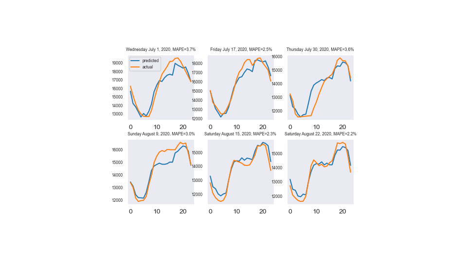

# Energy demand forecasting

This repository includes the codes and data for the coding challenge for ontario demand forecasting

##### Project objectives
1. Clean and prepare data
2. Build a proper neural network (LSTM) model
3. Evaluate the predictions versus actuals 

##### Datset summary
Dataset includes energy consumption, day of the week, and weather data for 24 hours from 2016 to 2020. Also as mentioned, dataset includes missing values for some hours of days, which will be filled with proper values (in clean_demand.ipynb) . 

### Methods Used
* Data Wrangling
* Feature engineering
* Neural Networks
* Predictive Modelling

### Technologies
* Python
* Keras, Tensorflow
* Pandas, Numpy, Jupyter

## Project Objective
The main question is:

***Employ a forecasting model that gives a Mean Absolute Error Percentage (MAPE) less than 5% for some day in August (or July)***

Timeseries forecasting model implemented for this question is:
* Long-Short Term Memory Nerual Network (LSTM)

### Data source
Data source is provided in the file Sample Dataset.csv in the data folder.

### Feature used in the model

Features used to generate forecasts include hourly energy consumption, the weather data, days of the week. A detailed decrption of each feature is below:

- Power demand 
- Two PCA vectors generated from weather data
- Days of the week one hot encoded
- Holidays one hot encoded

The output is the expected demand per hour for 24 hours. The forecast is generated from 00:00 each day, over the course of one year testing period.

### The feature extraction for the model

The default lags are the previous 7 days. However, we can go beyond 7 days by setting the extra_lag parameter to True in which case multiples of 7 back from a day up to a maxium lookback would also be taken into account. So, if we go by extra_lag=True, then lags of 1, 2, 3, 4, 5, 6, 7, 14, 21, ... up to max_lookback parameter would also be taken into account. Multiples of 7 is considered as defaul value since it is reported in similar studies and it resulted in the desired outcome for this problem. 

## To run the model

1. Raw data used is found in Sample Dataset.csv in the data folder.
3. After running the clean_demand.ipynb, the processed data ready as the input for LSTM model is created in the data folder and named as clean_data_ondemand_pca.csv 
4. Model pipeline could be found in the file predict_demand.ipynb
5. Executing predict_demand.ipynb, results in the MAPE and relevant graphs for the demand predictions for 3 days in July and 3 days in August 2020 (see picture below)
  

## Jupyter files

* [cleaning data](https://github.com/abdolmaj/ont-deman/blob/main/clean_demand.ipynb)
* [model](https://github.com/abdolmaj/ont-deman/blob/main/predict_demand.ipynb)
